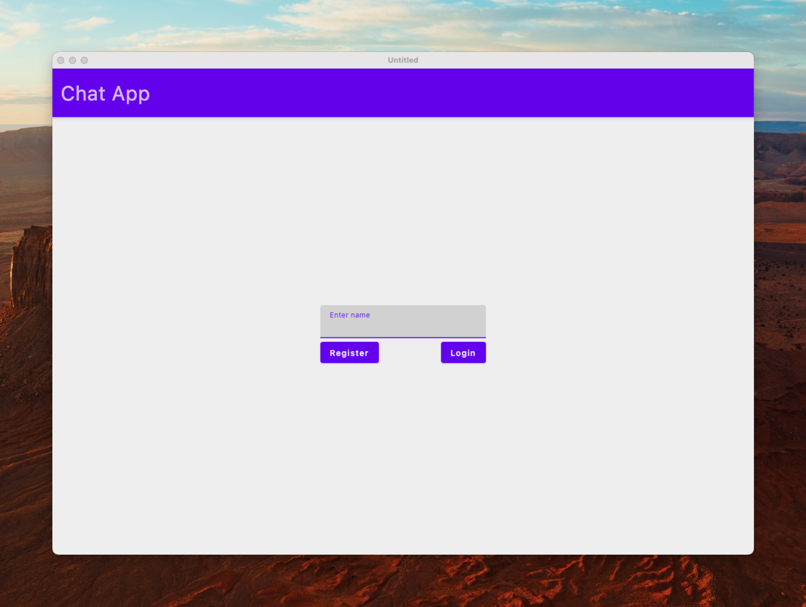
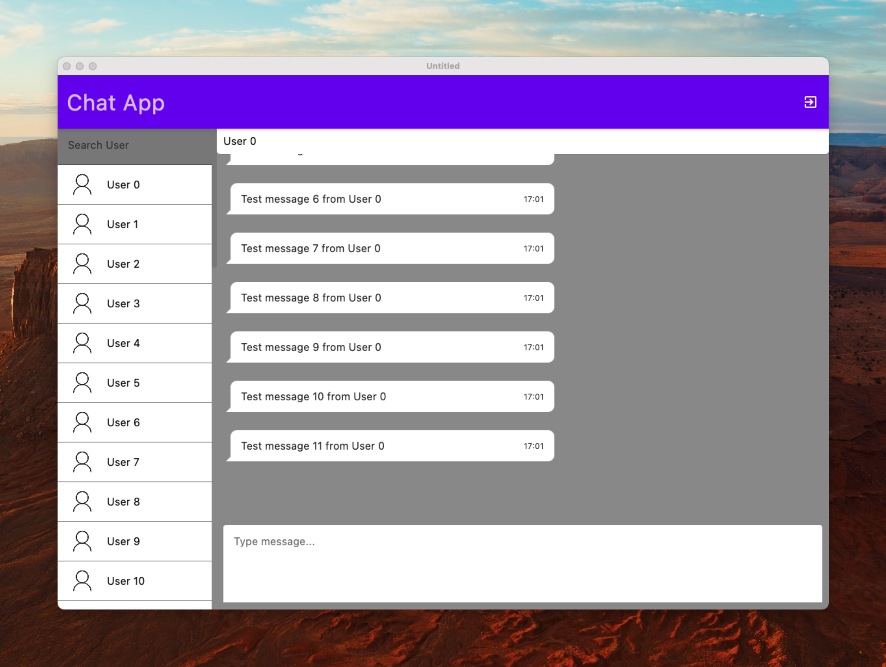

# chat-client-kt

## Description
A simple chat client I wrote to communicate with my [Chat Server](https://github.com/teichholz/chat-server-kt). It uses [Compose Multiplatform](https://www.jetbrains.com/lp/compose-multiplatform/) to compile the code into a native application.  

Features:
- Bidirectional communication with message server
- Uses HTTP basic authentication to authenticate against message server
- Respects XDG_CACHE_DIR to cache messages locally 
- Uses Kotlins awesome Flows to handle state :)

## Images

